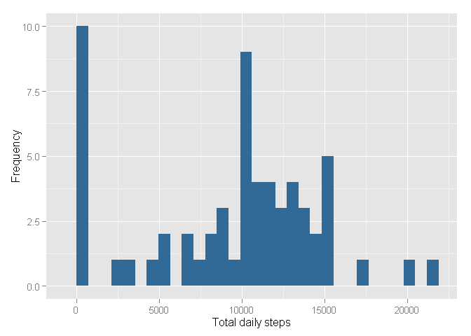
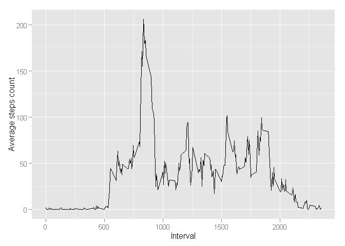
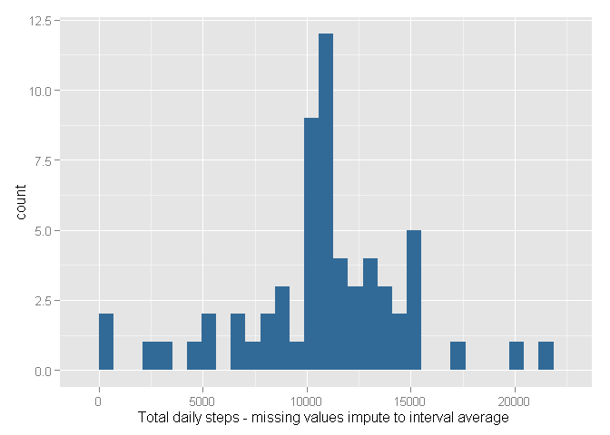
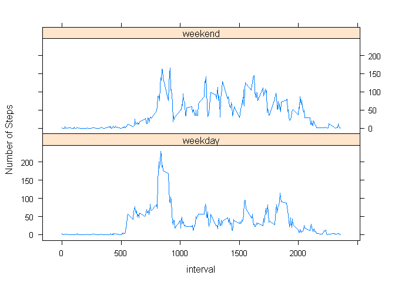

# Reproducible Research: Peer Assessment 1


## Loading and preprocessing the data


```r
        data<-read.csv("activity.csv")
        activity<-tbl_df(data)
```


## What is mean total number of steps taken per day?


```r
        # Grouping the data  per day and summarize the total number of steps per day
        by_date<-group_by(activity, date)
        s<-summarise(by_date, totalSteps = sum(steps, na.rm=TRUE))
        
        # Calculating the mean and median values
        mean<-format(mean(s$totalSteps), nsmall=2)
        median<-format(median(s$totalSteps), nsmall=2)
        
        # Plotting the histogram ofthe total number of steps frequency using ggplot
        h<-ggplot(s, aes(x=totalSteps))
        h + geom_histogram(aes(fill = 13)) + 
                xlab("Total daily steps") + 
                ylab("Frequency") +
                theme(legend.position ="none")
```

 


The mean of the total number of steps taken each day is  **9354.23**.

The median of the total number of steps taken each day is **10395**.


## What is the average daily activity pattern?


```r
        # Grouping the data  per interval and calculating the mean steps number in each interval
        by_intv<-group_by(activity, interval)
        m<-summarise(by_intv, averageSteps = mean(steps, na.rm=TRUE))
        
        # Retrieving the interval with the maximum number of average steps
        max_intv<-subset(m, averageSteps == max(averageSteps) , select = interval)
        
        # Plotting the average steps number as a function ofthe daily interval using qplot 
        qplot(interval,averageSteps, data=m, geom="line", xlab="Interval", ylab="Average steps count")
```

 

The interval **835** contains the maximum number of steps on average across all the days in the dataset.


## Imputing missing values

```r
        # Counting rows with missing steps 
        missing_rows<-nrow(subset(activity,is.na(steps)))
```

The numbers of rows with missing values (reported as NA) is **2304**.


```r
        # Imputation of missing values - 
        # imputation method - each NA will be replaced with the average steps number
        # of the same interval accross all days in the dataset

        # Merging the original activity data with the average interval steps number data "m"
        t<-left_join(activity, m)
        # Applying the imputation - if steps is NA then replace it with the average steps number
        t$steps<-mapply(function(x,y) if (is.na(x)) {y} else {x},t$steps,t$averageSteps)
        
        # grouping the resulting dataset by day and summarizing the total number of steps on each day
        by_date_impute<-group_by(t, date)
        s_impute<-summarise(by_date_impute, totalSteps_impute = sum(steps))

        # Calculating the new median and mean after the missing data imputations        
        mean_imp<-format(mean(s_impute$totalSteps_impute), nsmall=2)
        median_imp<-format(median(s_impute$totalSteps_impute), nsmall=2)
        
        # Plotting the histogram of the toal number of steps frequency after imputation
        h<-ggplot(s_impute, aes(x=totalSteps_impute))
        h + geom_histogram(aes(fill = 13)) + 
            xlab("Total daily steps - missing values impute to interval average ")  +
            theme(legend.position ="none")
```

 

The mean of the total number of steps taken each day after imputation of the missing values is  **10766.19**.

The median value of the total number of steps taken each day after imputation of the missing values is **10766.19**.

These two values are higher after imputating the missing data and represent a more normal distribution.


## Are there differences in activity patterns between weekdays and weekends?


```r
        # Adding new variables to the imputated data of week day 'DAY', 
        # and the weekday/weekend variable 'WD
        w<-by_date_impute %>% mutate(Day = weekdays(as.Date(date, "%Y-%m-%d")), 
                                     WD= ifelse(
                                             Day %in% c("Saturday", "Sunday"),
                                             c("weekend"),c("weekday")))
        # Converting 'WD' to a factor
        w$WD<-factor(w$WD)

        # Grouping the resulted data by the factor 'WD' and by interval,
        # and calculating the average steps in each interval for the weekdays and weekends
        by_wd<-group_by(w, WD, interval)
        by_wd_ave<-summarise(by_wd, averageSteps = mean(steps))

        # Plotting the resulting data using xyplot 
        xyplot(averageSteps ~interval | WD, by_wd_ave, 
               layout=c(1,2), type="l", 
               ylab = "Number of Steps")
```

 
